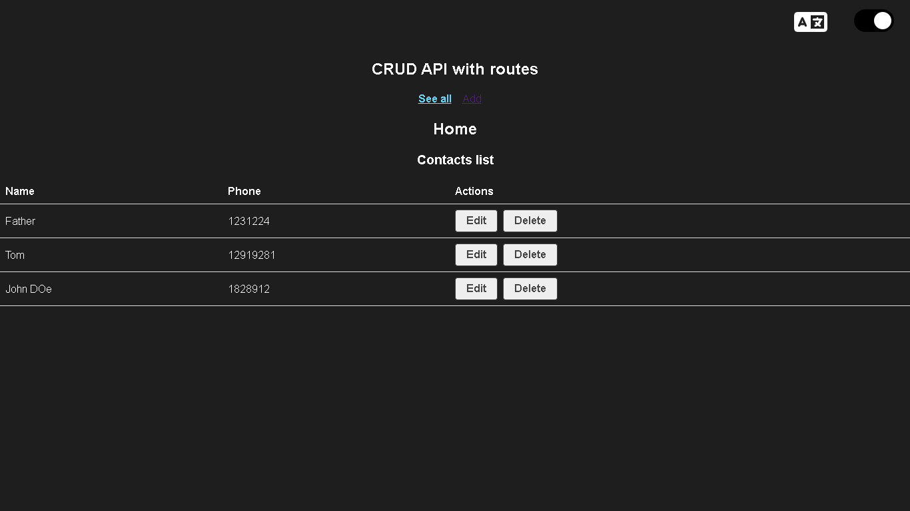

# Getting Started with Create React App

This project was bootstrapped with [Create React App](https://github.com/facebook/create-react-app).

## Available Scripts

In the project directory, you can run:

### `npm start`

Runs the app in the development mode.\
Open [http://localhost:3000](http://localhost:3000) to view it in your browser.

The page will reload when you make changes.\
You may also see any lint errors in the console.

## Table of contents

- [Overview](#overview)
  - [Screenshot](#screenshot)
  - [Links](#links)
- [My process](#my-process)
  - [Built with](#built-with)
  - [What I learned](#what-i-learned)
  - [Continued development](#continued-development)
  - [Useful resources](#useful-resources)
- [Author](#author)
- [Acknowledgments](#acknowledgments)

## Overview

### Screenshot

### Links

- Live Site URL: [URL](https://contacts-app-with-react.netlify.app/)

## My process

### Built with

- Semantic HTML5 markup
- CSS custom properties, grid and flexbox
- React router
- Context hook
- Firebase realtime database
- TypeScript
- [React](https://reactjs.org/) - JS library

### What I learned

I learned how to implement a Firebase database in web apps

## Author

- Website - [Sebastian Parias](https://sebastianparias.github.io/)
- LinkedIn - [sebastian-parias](https://www.linkedin.com/in/sebastian-parias/)